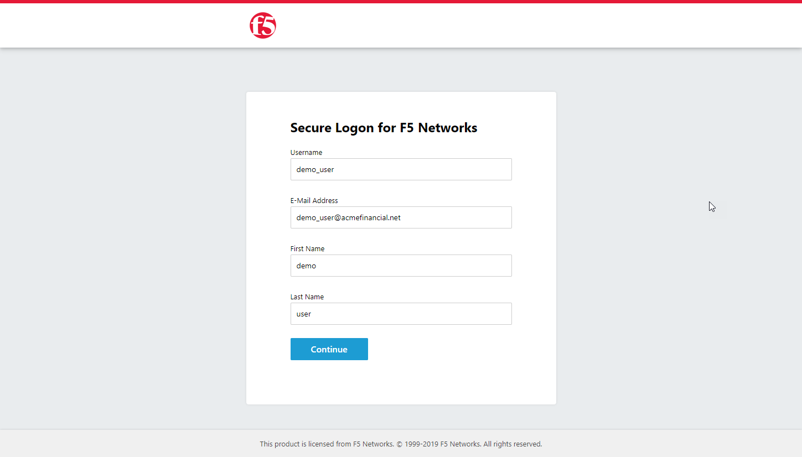

This document is meant to help you get started with using OAuth with BIG-IP and NGINX+, it is not meant to document functionality


# Before you get started
This setup guide will assume you already have the following setup
- BIG-IP Initial configuration with virtual-server listening on HTTPS and a valid license for BIG-IP Access
  - Initial config docs → https://techdocs.f5.com/en-us/bigip-15-1-0/big-ip-system-initial-configuration.html
- NGINX JQ,NGINX and NGINX-NJS module installed
  - Installing NGINX+ → https://docs.nginx.com/nginx/admin-guide/installing-nginx/installing-nginx-plus/ 
  - Installing NGINX-NodeJS → https://docs.nginx.com/nginx/admin-guide/dynamic-modules/nginscript/ 
- NGINX & OpenID Connect: 
  - This document is based on this example setup →  https://github.com/nginxinc/nginx-openid-connect

# Configuring BIG-IP Access
For more information on BIG-IP OAuth see → 
https://techdocs.f5.com/kb/en-us/products/big-ip_apm/manuals/product/apm-authentication-sso-13-1-0/38.html

## JSON Web Token

1. Import/Create a certificate that will be used for signing JWT **( System > Certificate Management > Traffic Certificate Management > SSL Certificate List )**

1. Create JSON Web Token **( Access > Federate > JSON Web Token > Key Configuration )** (Note: When creating the key the ID field is required)


## OAuth Scopes
Scopes will be displayed for approval when the user requests an OAuth token from the BIG-IP, 'Scope Name' on the client and server should match (They are case sensitive)


1. Create Scopes **( Access > Federate > OAuth Authorization Server > Scope )**
   1. Scope Name == company
   1. Scope Name == eMail
   1. Scope Name == firstName
   1. Scope Name == lastName

## OAuth Claims
Claims will be sent back to the client as part of the OAuth response inside of the  id_token


1. Create Claims **( Access > Federate > OAuth Authorization Server > Claim )**
   1. claim_company
      - Claim Name == company
      - Claim Value == AcmeFinancial
   1. claim_email
      - Claim Name == eMail
      - Claim Value == %{session.logon.last.eMail}
   1. claim_firstName
      - Claim Name == firstName
      - Claim Value == %{session.logon.last.firstName}
   1. claim_lastName
      - Claim Name == lastName 
      - Claim Value == %{session.logon.last.lastName}

## Register Client Application
Client applications allow external applications to authenticate/authorize users


1. Create Client Application **( Access > Federate > OAuth Authorization Server > Client Application )**
   - Grant Type - **Check** Authorization Code / Hybrid
   - Redirect URI(s) - **Add** the scheme, domain, port and path of the client application 
     - Example: https://www.acmefinancial.net:443/_codexch
     - Note: The port must be included or the URL will not match
   - Support OpenID Connect - **Check** Enabled
   - Authentication Type  - **Select** Secret
   - Scopes - **Add** the scopes created in "OAuth Scopes" section

## OAuth Profile
OAuth profiles are used by Access profiles when authorizing clients


1. Create OAuth Profile **( Access > Federate > OAuth Authorization Server > OAuth Profile )**
   - Client Application  - **Add** the client application created in "Client Application" section
   - Support Opaque Token  - **Un-Check**
   - Support JWT Token - **Check** Enabled
   - Support OpenID Connect - **Check** Enabled
   - Issuer - **Textbox** should be set to the value of the OAuth server
     - Example: https://federate.acmefinancial.net
   - JWT Primary Key - **Select** the key created in "JSON Web Token" section
   - ID Token Primary Key  - **Select** the key created in "JSON Web Token" section
   - JWT Refresh Token Encryption Secret - **Textbox** should be a string of text used to secure communication
      - Example: SomeSecretString

## Access Profile
Access profiles are attached to virtual servers and allow clients to authenticate

1. Create Access Profile **( Access > Profiles / Policies > Access Profiles (Per-Session Policies) )**
   - OAuth Profile  - **Select** the OAuth Profile created in "OAuth Profile" section
   - Languages  - **Add** all appropriate langues for your users (At least one must be added)


1. Edit Access Profile
   - 
   1. Create a custom logon page
      - Input Field 1 == username
      - Input Field 2 == eMail
      - Input Field 3 == firstName
      - Input Field 4 == lastName
      - 
   1. Create OAuth Authorization
      - Subject - **Textbox** %{session.logon.last.username}
      - Scopes (ID Token Claims) - **Check** all claims created in "OAuth Claims" section
      - 

1. Apply Access Profile
- 

# Configuring NGINX+
Before configuring NGINX+ to be the OAuth client you will need the client_id and secret from the BIG-IP. If you go back to the "Client Application" section from earlier you should be able to click on it and get the appropriate information


##  Clone GitHub NGINX-OpenID-Connect
```bash
cd /etc/nginx/conf.d
git clone https://github.com/nginxinc/nginx-openid-connect
```

## Create/Import certificate for NGINX+
If you already have a valid certificate you can use that or you can create one for testing
```bash
openssl req -x509 -nodes -days 365 -new -sha256 -keyout /etc/nginx/server.key -out /etc/nginx/server.crt -config <(
cat <<-EOF
    [req]
    default_bits = 2048
    prompt = no
    default_md = sha256
    distinguished_name = dn

    [ dn ]
    C=US
    O="Acme Financial“
    emailAddress=no-reply@acmefinancial.net
    CN = www.acmefinancial.net
EOF
)
```

## Configure NGINX+ to act as OAuth client application
**Note**: You will need the client_id and secret collected earlier

```bash
## -i should be the client_id retrieved from the BIG-IP
## -s should be the client_secret retrieved from the BIG-IP
## replace federate.acmefinancial.net with the domain you established for your BIG-IP virtual server

cd /etc/nginx/conf.d
./configure.sh \
	-k file \
	-x \
	-i 141890e7fd32a2a19a7a70f2f44506b8368c4ce3b6d1c85e \
	-s 57529b8b7f458a0e69d6621f0d90bcd9cf99f5ba314d06b8368c4ce3b6d1c85e \
	https://federate.acmefinancial.net/f5-oauth2/v1/.well-known/openid-configuration
```

## Update frontend.conf
### Add a new  main server directive add a location block to handle demo responses
```bash
server {

    listen 8080;
    default_type  text/plain;
set $_response '$http_company is excited to Welcome $http_first $http_last to the organization
Look for more information in your e-mail address --> $http_email';

    return 200 $_response;
}
```
### Inside of the main server directive add a location block to handle favicons
```bash
## Browsers try to load favicon.ico by default and this can cause issues
location = /favicon.ico {
    return 403;
}
```
### Inside of the main server directive update the /  location block
```bash
location / {
    
    # This site is protected with OpenID Connect
    auth_jwt "" token=$session_jwt;
    auth_jwt_key_file $oidc_jwt_keyfile; # Enable when using filename
    
    #auth_jwt_key_request /_jwks_uri; # Enable when using URL
    
    # Absent/invalid OpenID Connect token will (re)start auth process (including refresh)
    error_page 401 = @oidc_auth;
    
    # Successfully authenticated users are proxied to the backend,
    
    ## Start add section ##
    proxy_set_header first $jwt_claim_firstName;
    proxy_set_header last $jwt_claim_lastName;
    proxy_set_header email $jwt_claim_eMail;
    proxy_set_header company $jwt_claim_company;
    ## Stop add section ##

    # with 'sub' claim passed as HTTP header
    proxy_set_header username $jwt_claim_sub;
    
    ## Start added for demo ##
    proxy_pass http://localhost:8080; # The backend site/app
    ## Stop added for demo ##

    access_log /var/log/nginx/access.log main_jwt;
}
```

## Update openid_connect.server_conf
You will need to add any additional scopes that will be requested to this file
### Update the "location @oidc_auth" block and replace the "return 302" with the snippet below
```bash
return 302 "$oidc_authz_endpoint?response_type=code&scope=openid+profile+company+eMail+lastName+firstName&client_id=$oidc_client&state=0&redirect_uri=$scheme://$host:$server_port$redir_location&nonce=$requestid_hash";
```

# Demo Experience
1. Browse to your example application, notice that you are redirected to the BIG-IP
1. Input example data in the provided fields
   - 
1. Accept the Authorization Requests
   - 
1. Congrats on a successful demo